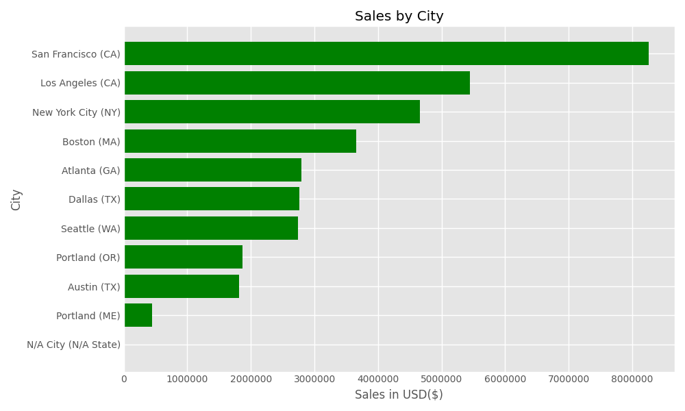
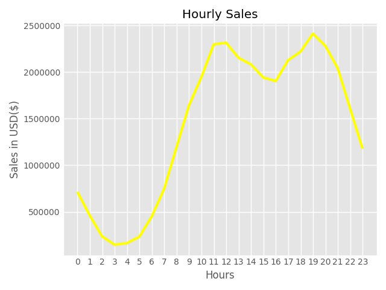
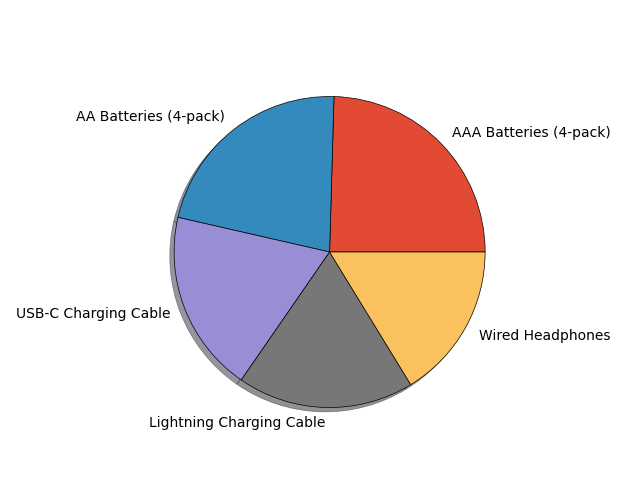
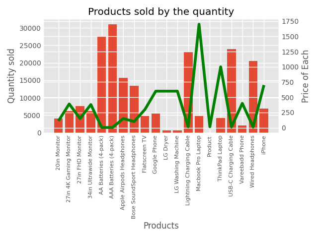

#  Sales Data Analysis Project

> A complete end-to-end data analysis project uncovering revenue trends, customer behavior, and product performance from 12 months of real-world sales data — built with Python.

---

##  Overview

This project covers the full data analytics pipeline — from merging and cleaning raw multi-file CSVs to generating clear, business-ready insights through exploratory data analysis and visualization.

**Skills demonstrated:** data cleaning · EDA · visualization · business insight generation · Python analytics

---

##  Business Questions Answered

| # | Question |
|---|----------|
| 1 | Which month generated the highest sales revenue? |
| 2 | Which city generated the highest revenue? |
| 3 | What is the best time to display advertisements? |
| 4 | Which products are sold the most? |
| 5 | How does product price relate to sales volume? |

---

##  Dataset

Multiple monthly CSV files merged into one unified dataset containing customer order records.

| Column | Description |
|--------|-------------|
| `Order ID` | Unique transaction identifier |
| `Product` | Item purchased |
| `Quantity Ordered` | Number of units |
| `Price Each` | Unit price (USD) |
| `Order Date` | Purchase timestamp |
| `Purchase Address` | Customer location |

---

##  Data Cleaning

- Merged 12 monthly CSV files into a single dataset
- Removed duplicates and repeated header rows
- Handled missing and null values
- Converted `Order Date` to `datetime` format
- Cast quantity and price columns to correct numeric types
- Validated outliers and exported `cleaned_sales_data.csv`

---

## Key Findings & Visualizations

### 1. Sales by Month — *Which month performed best?*


**December dominated** with ~$4.6M in revenue — nearly 2.5× January's figure. The clear seasonal trend shows Q4 outperforming the rest of the year, driven by holiday shopping and year-end spending.

>  **Recommendation:** Ramp up inventory and marketing in Q4, especially October–December.

---

### 2. Sales by City — *Where are customers spending the most?*



**San Francisco, CA** leads by a wide margin at ~$8.3M, more than 1.5× second-place Los Angeles (~$5.4M). California cities collectively dominate the revenue chart.

>  **Recommendation:** Prioritize marketing budgets and stock allocation toward CA, NY, and MA markets.

---

### 3. Hourly Sales Trends — *When should ads run?*



Customer spending peaks at **11 AM–12 PM** (~$2.3M) and again sharply at **7–8 PM** (~$2.4M) — corresponding to lunch breaks and evening leisure time. Activity drops to its lowest between 3–5 AM.

>  **Recommendation:** Schedule ad campaigns, email blasts, and push notifications around 11 AM and 7 PM for maximum conversion.

---

### 4. Top Products by Share — *What do customers buy most?*




The five highest-volume products are near-equally split — AAA Batteries, AA Batteries, USB-C Charging Cable, Lightning Charging Cable, and Wired Headphones. All share a common profile: affordable, consumable, and frequently replaced.

>  **Recommendation:** Keep these in permanent stock and use them as bundle anchors to drive average order value.

---

### 5. Price vs. Quantity Sold — *Does price drive demand?*



A clear inverse relationship exists — **Lightning Charging Cable** leads in quantity sold (~31,000 units) at a low price point, while premium items like the **MacBook Pro Laptop** sell far fewer units despite high price tags.

>  **Recommendation:** Maintain a balanced portfolio — low-cost accessories drive volume; premium products drive margin.

---

## Project Structure

```
Sales_Data_Analysis/
│
├── cleaned_sales_data.csv
├── cleaned_sales_data.ipynb
├── sales_dataset_analysis.ipynb
├── README.md
│
└── Visualizations/
    ├── plot1.png
    ├── plot2.png
    ├── plot3.png
    ├── plot4.png
    └── plot5.png
```

---

##  Getting Started

```bash
# Clone the repo
git clone https://github.com/your-vaibhavkr-builds/sales-data-analysis.git
cd sales-data-analysis

# Install dependencies
pip install pandas numpy matplotlib jupyter

# Run the analysis
jupyter notebook sales_dataset_analysis.ipynb
```

---

##  Connect

[](https://linkedin.com/in/your-profile)
[](https://github.com/your-username)
